## Getting started

### Prerequisites

Before starting, ensure you have the latest Shopify CLI installed:

- [Shopify CLI](https://shopify.dev/docs/api/shopify-cli) – helps you download, upload, preview themes, and streamline your workflows

If you use VS Code:

- [Shopify Liquid VS Code Extension](https://shopify.dev/docs/storefronts/themes/tools/shopify-liquid-vscode) – provides syntax highlighting, linting, inline documentation, and auto-completion specifically designed for Liquid templates

This project uses **Shopify Skeleton theme** with **Tailwind CSS**. You can run it locally for development.

- [Node.js]Node.js and npm installed

### Clone

Clone this repository using Git or Shopify CLI:

```bash
git clone https://github.com/lbabyuk/pdp-shopify.git
cd <your-repo-folder>
npm install
-in the root add file shopify.theme.toml
[environments.development]
store="https://your-store.myshopify.com/"
theme_id = "YOUR_THEME_ID"
npm run dev
```
## What was implemented
### Metaobjects and Metafields
This theme uses **Shopify metaobjects and metafields** to make content more flexible and dynamic without hardcoding it into the theme:
Used for **Reviews**, **Product Accordion**, **Product description**, **Customer Benefits**, **Size Guide**

- **Metafields** :
  1.product.metafields.custom.size_fit_new;
  2.product.metafields.custom.product_notes;
  3.product.metafields.custom.returns_policy;
  4.product.metafields.custom.size_guide;
  5.product.metafields.custom.description;

- **Metaobjects** :
  1.product.metafields.custom.reviews_json;
  2.product.metafields.custom.customer_benefits;

### Additional Features

This theme leverages advanced Shopify features to enhance performance and flexibility:

- **Section Rendering API**:  
  Used to dynamically render **PDP**

- **Integration with Search & Discovery App**:  
  **product recommendations** for a better shopping experience

**Main Product Section**:

**Functionality:**
- **Product Title** – Displays the product name prominently.
- **Price** – Shows main price and `compare_at_price` when applicable.
- **Variant Selection (Size / Color)** – Customers can select variants.
- **Quantity Selector** – Allows choosing the desired quantity.
- **Add to Cart Button** – Fully functional with Shopify cart integration.
- **SKU / Vendor** – Displays SKU and vendor information.
- **Image Gallery** – Supports smooth scrolling and optional videos.
- **Dynamic Badges** – Shows badges based on product tags ("Highly rated", "on Sale", "Best Seller" ).

- Switching product options dynamically.
- Updating product prices on option changes.
- Accordion logic for collapsible sections.
- Handling product form submission.
- Error handling.
- Built with **Tailwind CSS**.
- Fully responsive across devices.
- Correct `alt` attributes for images.
- Correct `tabindex` usage for keyboard navigation
- Lazy-loading for images to improve page load speed.
- Repeated elements are extracted into **snippets**.
- `fetchpriority="high"` set for main product images to ensure fast loading.

  ### Additional Features

- **Show variant image on color selection**  
  When a customer selects a color option, the corresponding product image is displayed automatically.
- **Scroll gallery**  
  Implemented a smooth scrolling gallery for product images and media.
- **Video support**  
  Supports adding videos to the media gallery. Videos automatically **pause and play** as the user scrolls through the gallery.
- **Size guide Modal**  
  Fully configurable through a **metaobject - product.metafields.custom.size_guide**

### Screenshots

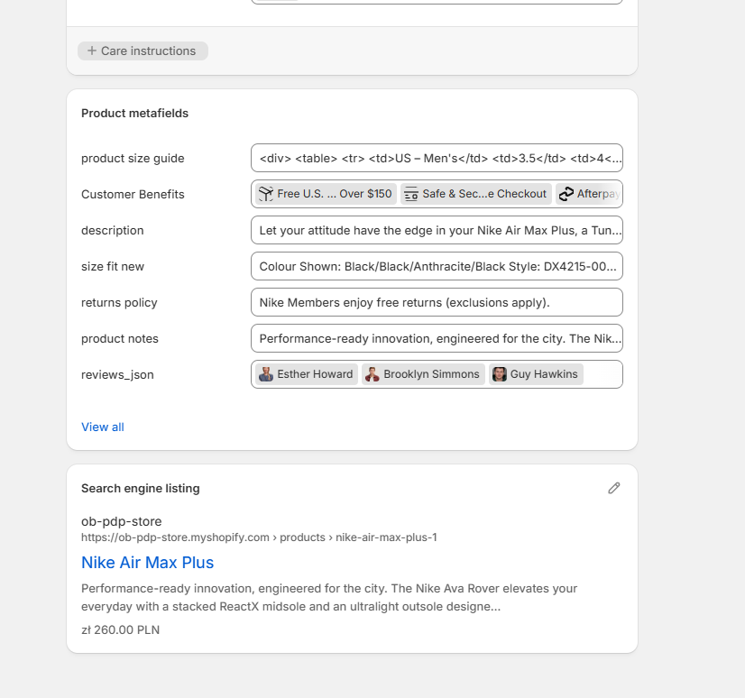

<hr>

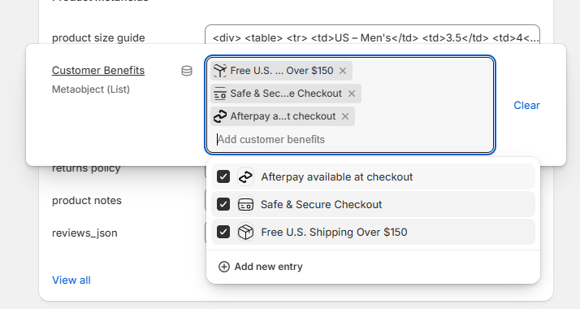

<hr>

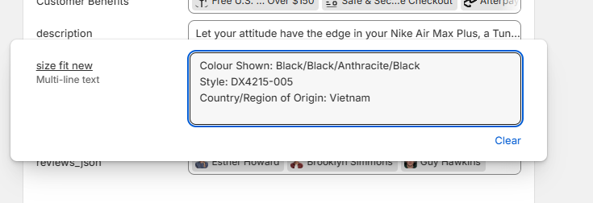

<hr>

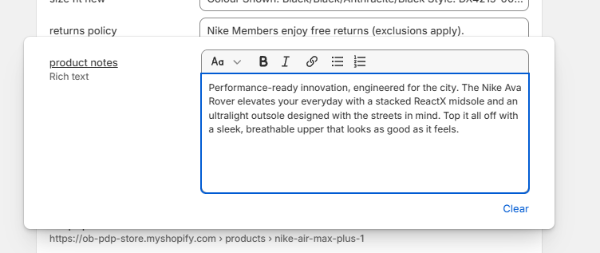

<hr>

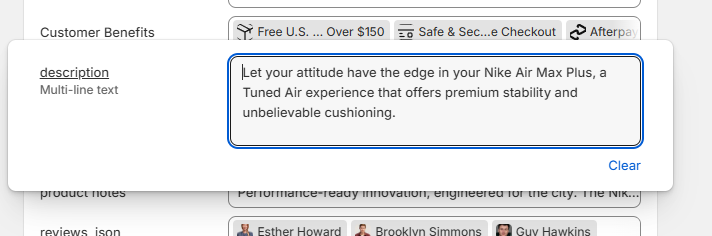

<hr>

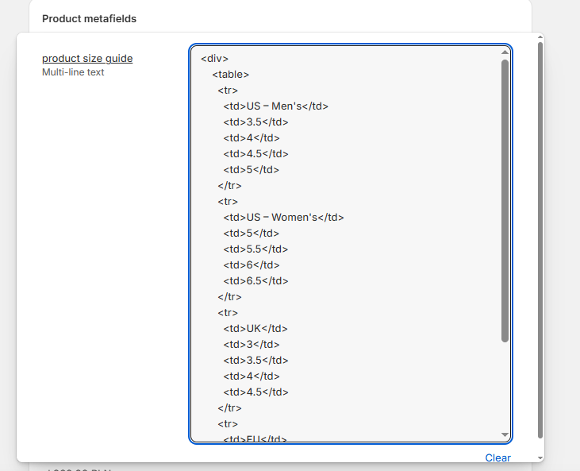

<hr>

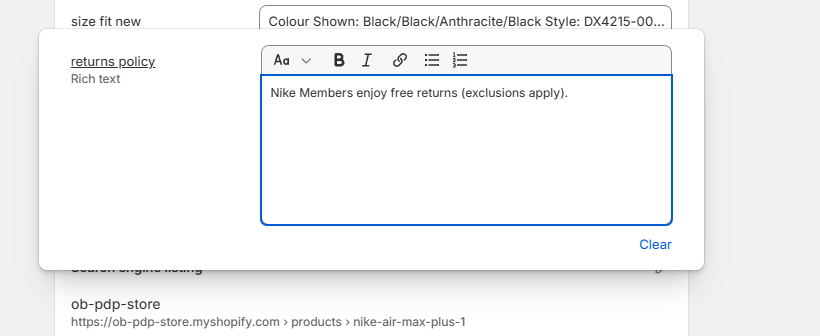

<hr>

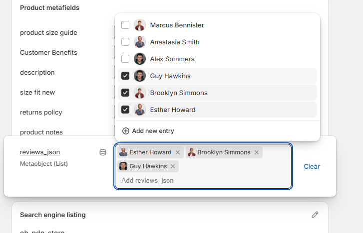

<hr>

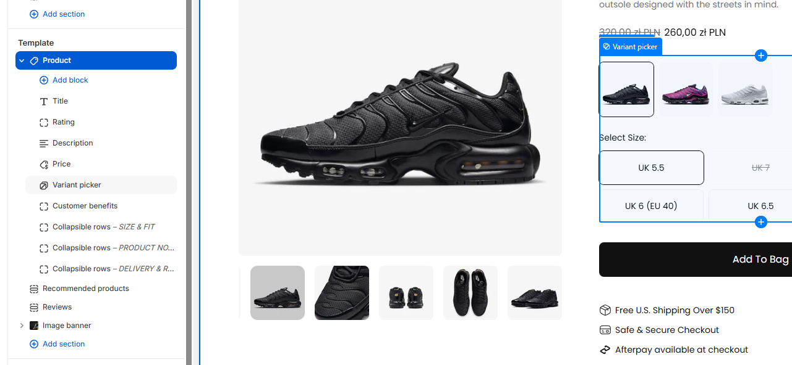

<hr>

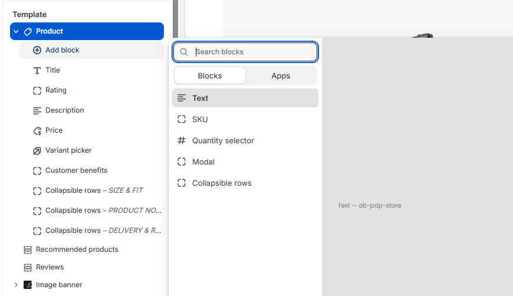

<hr>

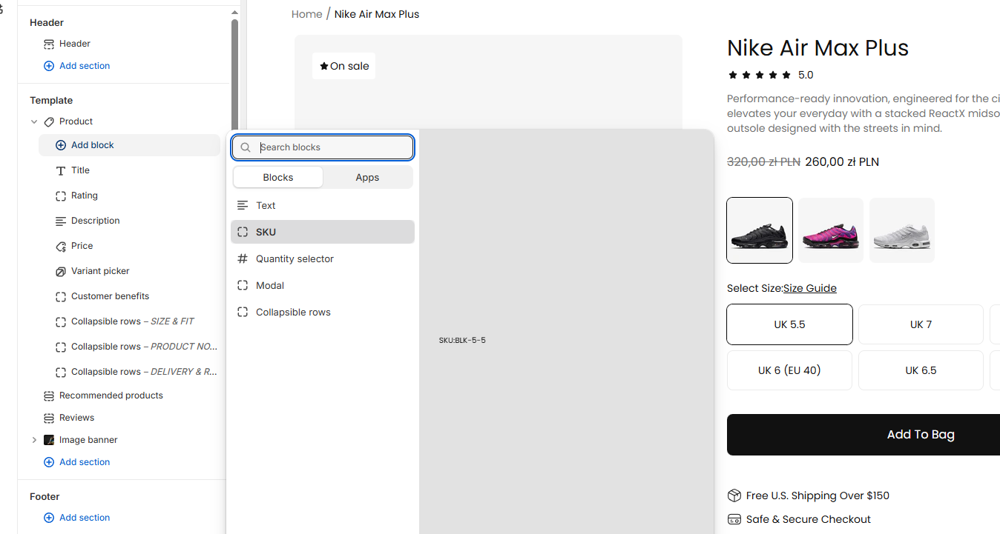
